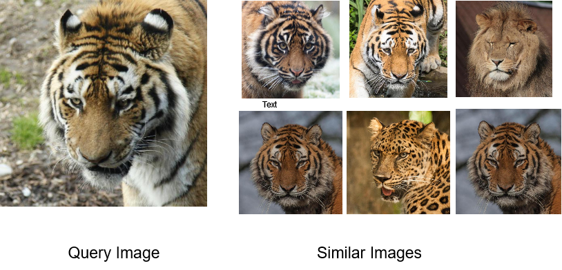
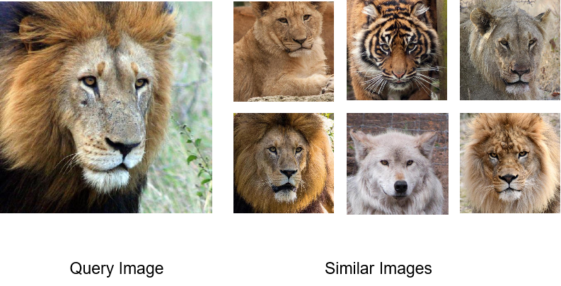

# Image Similarity using PyTorch


## Auto-encoder based Image-Similarity Engine

Blog Post is [here](https://medium.com/pytorch/image-similarity-search-in-pytorch-1a744cf3469)

Dataset is available over [Kaggle](https://www.kaggle.com/datasets/okeaditya/animals-data)

Published in Official PyTorch Medium Channel. Thank you PyTorch team !

- Builds a simple Convolutional Auto-encoder based Image similarity engine.
- This solves the problem of finding similar images using unsupervised learning. There are no labels for images.

Tasks that it can do.

- [x] Similar images using Auto-encoders.
- [x] Similar image search from image features.
- [x] Clustering similar images.

## Repostory Structure.
```
=== data                        Read data from here. It is in gitignore so it won't appear here.
=== docs                        Documentation using mkdocs.
=== image_similarity
====== cluster_images.py        Clusters the embeddings learnt using PCA and T-SNE.
====== torch_data.py            Contains Dataset class to create PyTorch dataset from folder.
====== torch_model.py           Convolutional Auto-enocder Model.
====== torch_engine.py          Train_step and validation_step for training.
====== torch_train.py           Trainng script. Trains Auto-enocder and saves the embeddings.
====== torch_infer.py           Contains inference code
====== config.py                Configurations of models and paths.
====== torch_inference.ipynb    Inference code in .ipynb to play with.
====== torch_train.ipynb        Stand-alone code to train in Jupyter.
=== tests                       Contains tests for CI
```

## Documentation

Please visit [here](https://oke-aditya.github.io/image_similarity) for documentation.

It contains detailed description of work.

## Image similarity Outputs

Some sample outputs of recommendations.





More outputs can be found in outputs folder.

## Models

- Some models trained using a sample dataset are given in [this](https://drive.google.com/drive/folders/1T6uS4O7LiuGMtXlRSMFmKAEDNQ08Ry25?usp=sharing) link.
- It contains encoder, decoder and numpy embeddings generated from auto-enocoders.
- These are obtained by running `torch_train.py` script.


