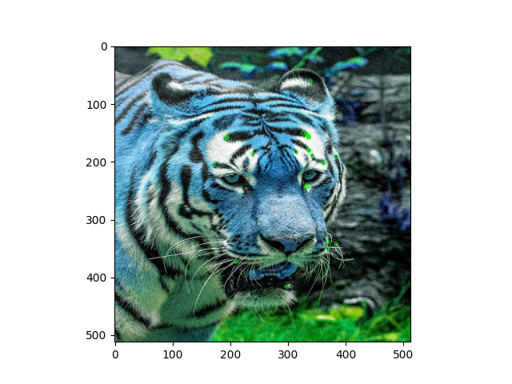

## Computing Images closest to given features.

We determine the prominent features from a given input image.

To determine the features which are required. 

It uses `cv2.ORB()` a fast technique for finding oriented, robust features.

ORB (Oriented FAST and Rotated BRIEF) gives top features in the given input image.

The features from ORB are converted to embedding.

We reduce dimensionality of embeddings obtained from auto-encoder to ORB embeddings. 

This allows us to search for to matches using Nearest Neighbors. 

Then it searches through the embeddings obtained from auto-encoder for images similar to embeddings from ORB.

Thus we get images that are similar to given features in an image.

## Outputs: -

- This is an image whose features have been computed using ORB.

- Recommended images, matching these features.

I have plotted keypoints on them.

We can see that the features extracted are similar.

